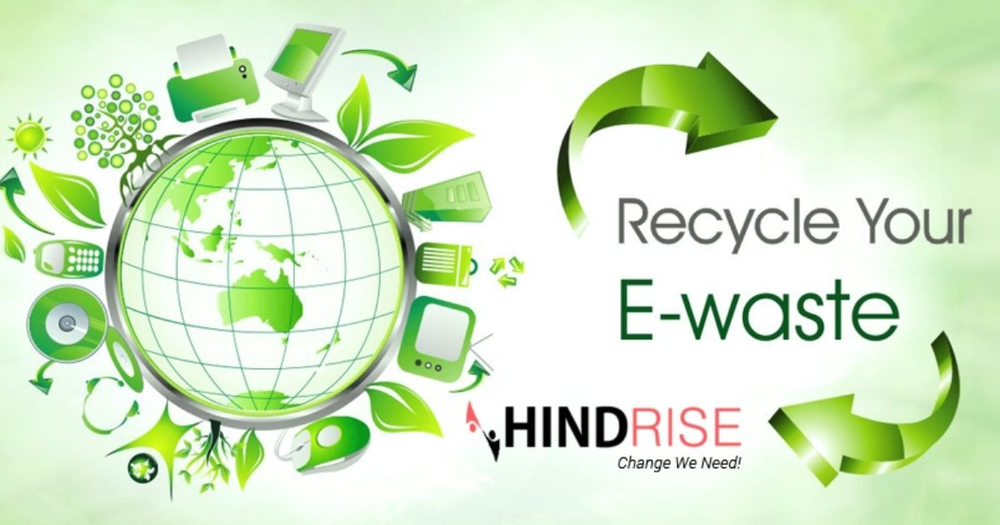

# ♻️ Eco-Recyclers: E-Waste Management Solutions

[](https://opensource.org/licenses/MIT)
[]()
[]()

**Eco-Recyclers** is a comprehensive web-based platform designed to tackle the growing problem of electronic waste in India. Our mission is to provide a seamless, responsible, and rewarding way for individuals and organizations to dispose of their E-waste while ensuring environmental sustainability and data security.

---

## 🌟 Key Features

- 📍 **Smart Locator**: Find authorized E-waste collection centers nearby using real-time geolocation and static database searching.
- 🚛 **Free Pickup Service**: Schedule a hassle-free, zero-cost pickup for your electronic items directly from your doorstep.
- 🔐 **Data Security**: Guaranteed destruction of sensitive data on your old devices through certified recycling partners.
- 🏆 **Rewards System**: Earn points for every successful recycling contribution, which can be tracked through your user profile.
- 📜 **Certified Recycling**: Partnered with TSPCB and CPCB authorized recyclers to ensure eco-friendly disposal.

---

## 📸 Screenshots

| Landing Page | Location Search | Pickup Scheduling |
| :---: | :---: | :---: |
|  |  |  |

---

## 🚀 Getting Started

### Prerequisites
To run this project locally, you only need a modern web browser. No complex installations are required as it uses pure HTML, CSS, and Vanilla JavaScript.

### Installation
1. Clone the repository:
   ```bash
   git clone https://github.com/B-koushik-09/E-waste-recyclers.git
   ```
2. Navigate to the project directory:
   ```bash
   cd eco-recyclers
   ```
3. Open `index.html` in your browser.

---

## 🛠️ Technology Stack

- **Frontend**: 
  -  
  -  
  - 
- **External APIs**: 
  - [Geoapify API](https://www.geoapify.com/) (for Geocoding and Places retrieval)
  - [FontAwesome](https://fontawesome.com/) (for iconography)
- **Storage**: Browser LocalStorage (for user authentication and pickup history)

---

## 📂 Project Structure

```text
eco-recyclers/
├── index.html           # Landing Page
├── home.html            # User Dashboard/Search Page
├── about.html           # Organization Mission & Info
├── login.html           # Authentication - Login
├── register.html        # Authentication - Sign Up
├── profile.html         # User Profile & History
├── pickup-details.html  # Multi-step Scheduling Form
├── script.js            # Core Logic (Search, API calls, Routing)
├── styles.css           # Global UI/UX Styles
└── assets/              # Images and Media assets
```

---

## ⚙️ Core Logic Flow

1. **Authentication**: Users sign up/login using LocalStorage-based authentication.
2. **Search**: The `script.js` uses a hybrid approach—checking a built-in list of centers and fetching real-time data from the **Geoapify API**.
3. **Scheduling**: A multi-step form collects item details, pickup address, and preferred time.
4. **History**: All scheduled pickups are saved to the user's local profile for tracking.

---

## 🤝 Contributing

Contributions are what make the open-source community such an amazing place to learn, inspire, and create. Any contributions you make are **greatly appreciated**.

1. Fork the Project
2. Create your Feature Branch (`git checkout -b feature/AmazingFeature`)
3. Commit your Changes (`git commit -m 'Add some AmazingFeature'`)
4. Push to the Branch (`git push origin feature/AmazingFeature`)
5. Open a Pull Request

---

## 📄 License

Distributed under the MIT License. See `LICENSE` for more information.

